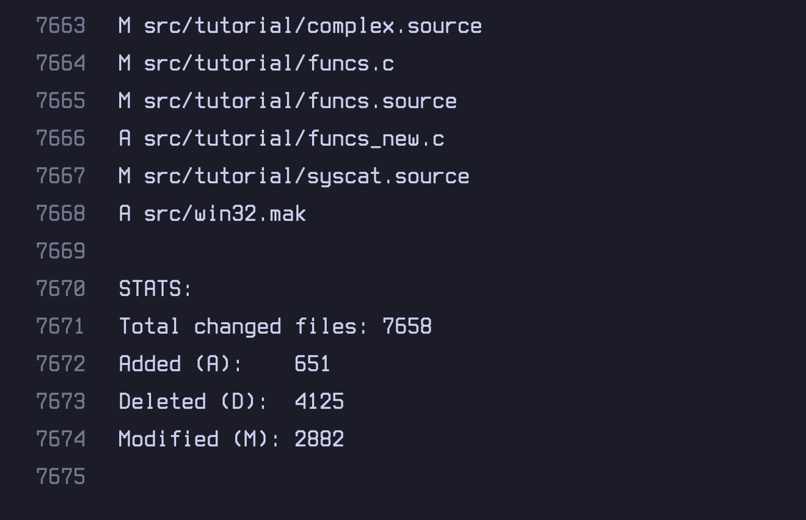
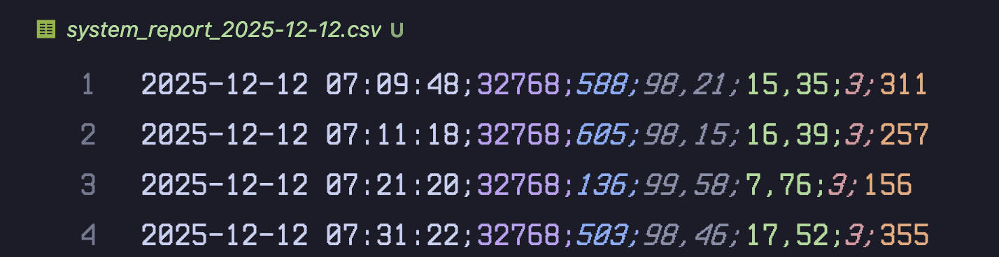
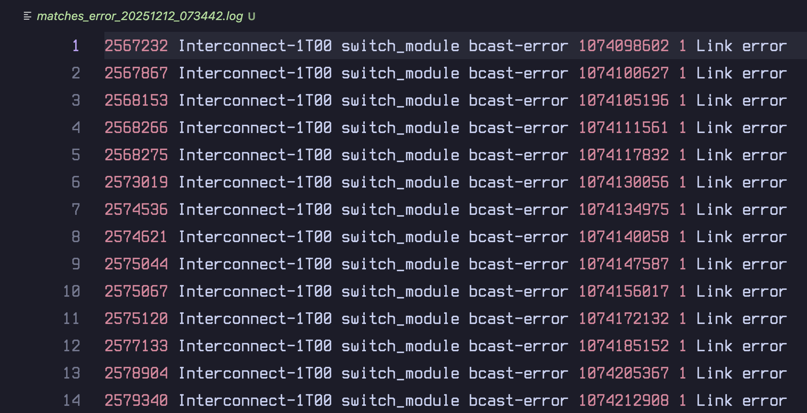

# Набор shell-скриптов: отчет по git-веткам, системный монитор, поиск в логах

## Описание
- `script1_diff_report.sh` — формирует текстовый отчет о различиях между двумя ветками удаленного репозитория (список A/M/D и статистика).
- `script2_sysmon.sh` — демон для мониторинга системы; каждые 10 минут пишет метрики в CSV.
- `script3_loggrep.sh` — ищет ключевое слово в лог-файле, сохраняет найденные строки и их количество.

## Подготовка
- Выдайте права на исполнение: `chmod +x script1_diff_report.sh script2_sysmon.sh script3_loggrep.sh`
---

## Скрипт 1: script1_diff_report.sh
Назначение:
- Сравнивает две ветки удаленного репозитория, выводит список измененных файлов (A/M/D) и статистику.

Вход:
- Параметры: `<repo_url> <branch1> <branch2>`

Выход:
- Файл в текущей директории: `diff_report_<branch1>_vs_<branch2>.txt`
- Разделы: заголовок с метаданными, список файлов (git diff --name-status), статистика (Total/Added/Deleted/Modified).

Примечания:
- Сравнение выполняется по `origin/branch1..origin/branch2`.
- Если различий нет — в отчете будет строка `(no differences)`.

Пример запуска:
- `./script1_diff_report.sh https://github.com/postgres/postgres master REL9_1_STABLE`

---

## Скрипт 2: script2_sysmon.sh
Назначение:
- Фоновый сбор системных метрик каждые 10 минут в CSV.

Команды:
- `START` — запускает демон в фоне и печатает PID (защита от повторного запуска).
- `STATUS` — показывает состояние (Running/Not running) и PID.
- `STOP` — останавливает процесс по PID.

Собираемые метрики:
- Память: общий объем (MB), свободный объем (MB), % использования.
- CPU: % загрузки CPU.
- Диск: % использования корневого раздела (`/`).
- Нагрузка: средняя за 1 минуту (load average 1m).

Формат CSV:
- Имя файла: `system_report_YYYY-MM-DD.csv` (в директории скрипта).
- Строка: `timestamp;all_memory;free_memory;%memory_used;%cpu_used;%disk_used;load_average_1m`

Файлы:
- `system_report_YYYY-MM-DD.csv` — данные за дату.
- `.sysmon.pid` — PID процесса.
- `.sysmon.log` — лог фонового процесса.

Примеры:
- Запуск: `./script2_sysmon.sh START`
- Проверка: `./script2_sysmon.sh STATUS`
- Остановка: `./script2_sysmon.sh STOP`

Изменение интервала:
- Переменная `INTERVAL_SEC=600` внутри скрипта. Для демонстрации можно временно поставить `10` или `30`.

Совместимость:
- Linux и macOS (на macOS метрики берутся из `top`/`vm_stat`/`sysctl`).

---

## Скрипт 3: script3_loggrep.sh
Назначение:
- Поиск фиксированной строки (ключевого слова) в лог-файле, сохранение совпадений и их количества.

Вход:
- Параметры: `<logfile> <keyword>`

Выход:
- `matches_<keyword>_<YYYYmmdd_HHMMSS>.log` — строки с совпадениями.
- `matches_count_<keyword>_<YYYYmmdd_HHMMSS>.txt` — количество найденных строк.
- Также количество выводится в консоль.

Пример запуска:
- `./script3_loggrep.sh HPC.log error`

Настройки поиска:
- По умолчанию поиск чувствителен к регистру (`grep -F`).
- Для нечувствительного поиска можно заменить на `grep -Fi` внутри скрипта.

---
