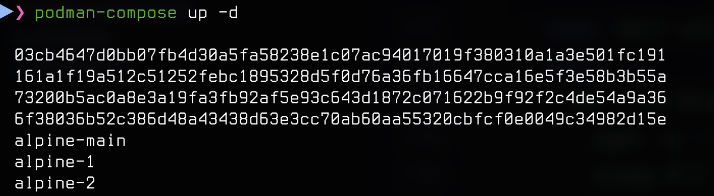
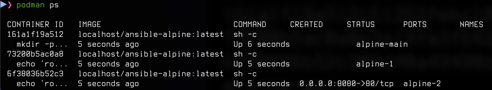
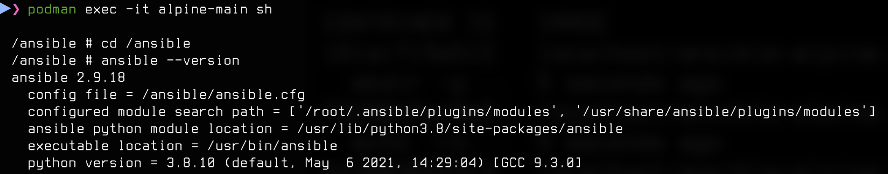
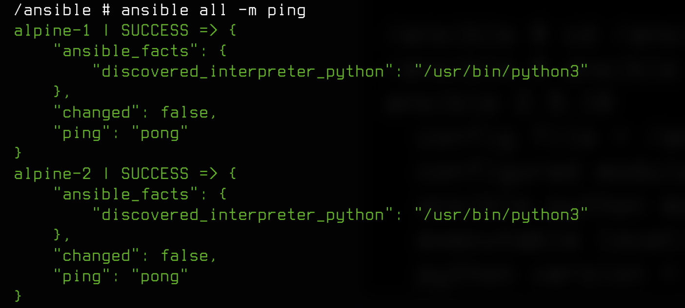
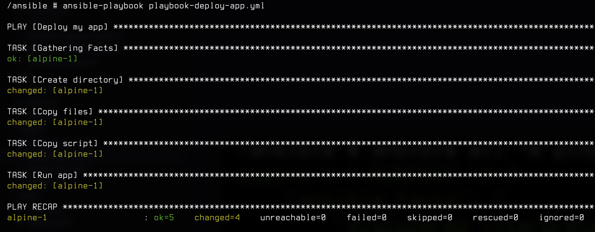
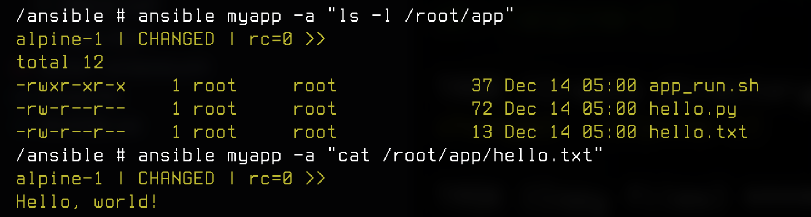
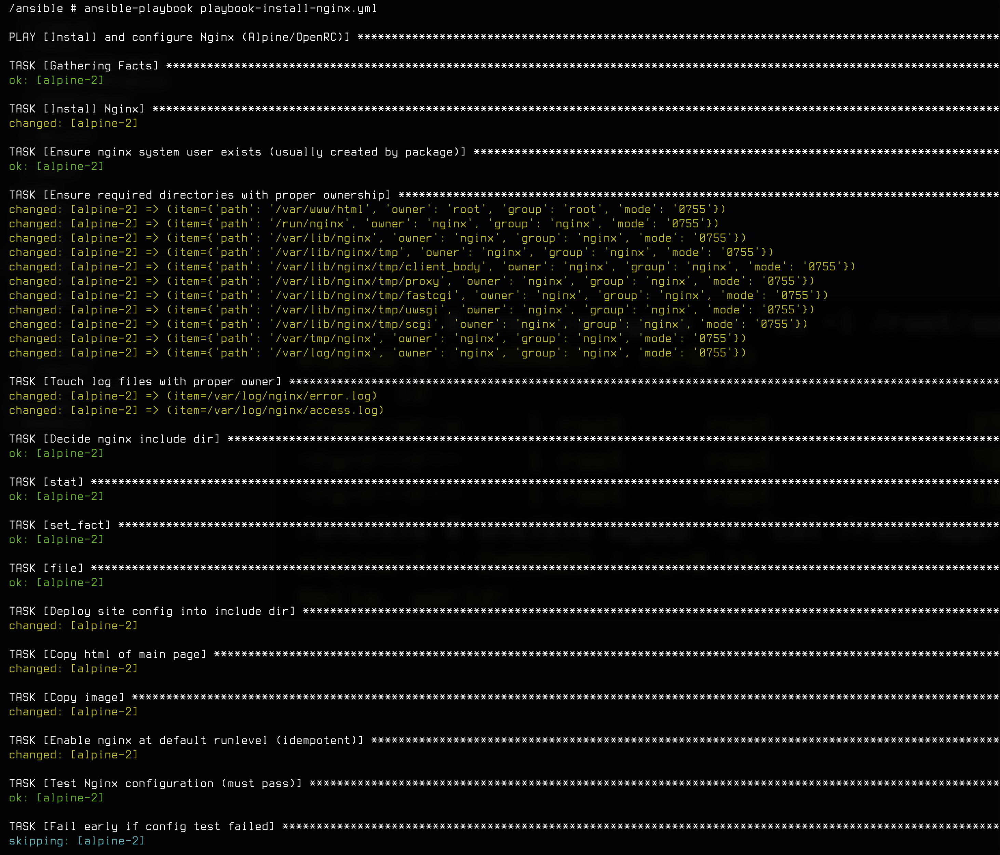
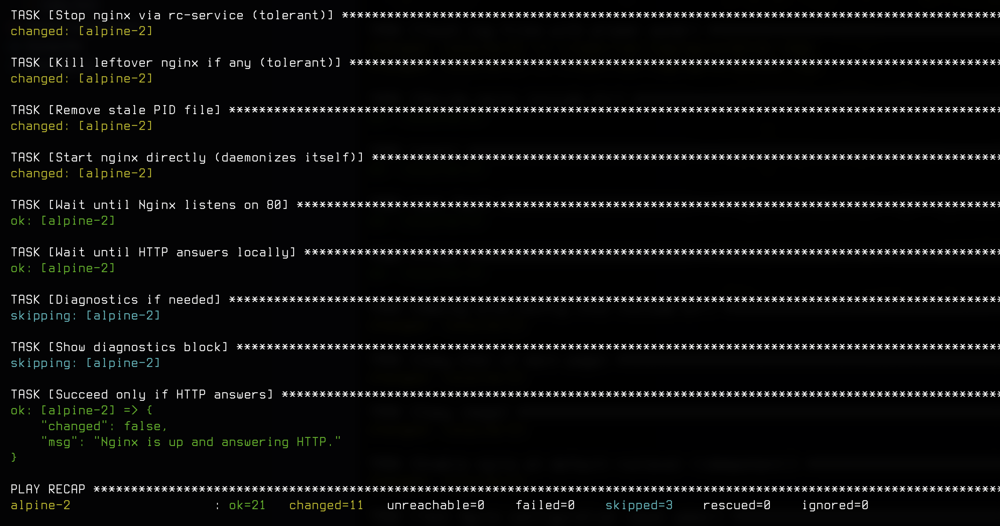

# Ansible

## Как возпроизвести


```
podman build -t ansible-alpine:latest .
```
- Поднимите стенд:
```
podman-compose up -d
```
- Проверьте, что все три контейнера запущены:
```
podman ps
```
Ожидаете alpine-main, alpine-1, alpine-2 (на alpine-2 проброшен порт 8080:80).

4) Зайдите в контейнер ansible-контроллера
```
podman exec -it alpine-main sh
```
Дальше команды выполняем внутри alpine-main.

5) Проверка Ansible 
```
cd /ansible
ansible --version
```
- Убедитесь, что хосты из инвентаря доступны:
```
ansible all -m ping
```
Ожидаете pong от alpine-1 и alpine-2.

6) Деплой приложения
```
ansible-playbook playbook-deploy-app.yml
```
- Проверим, что файл создан и содержит строку:
```
ansible myapp -a "ls -l /root/app"
```
```
ansible myapp -a "cat /root/app/hello.txt"
```
Должно показать Hello, world!

7) Установка и настройка Nginx
```
ansible-playbook playbook-install-nginx.yml
```


- Откройте в браузере:
- http://localhost:8080


## Пример воспроизведения











